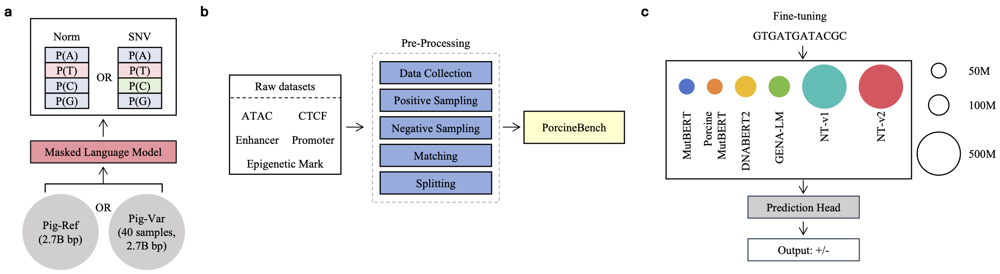
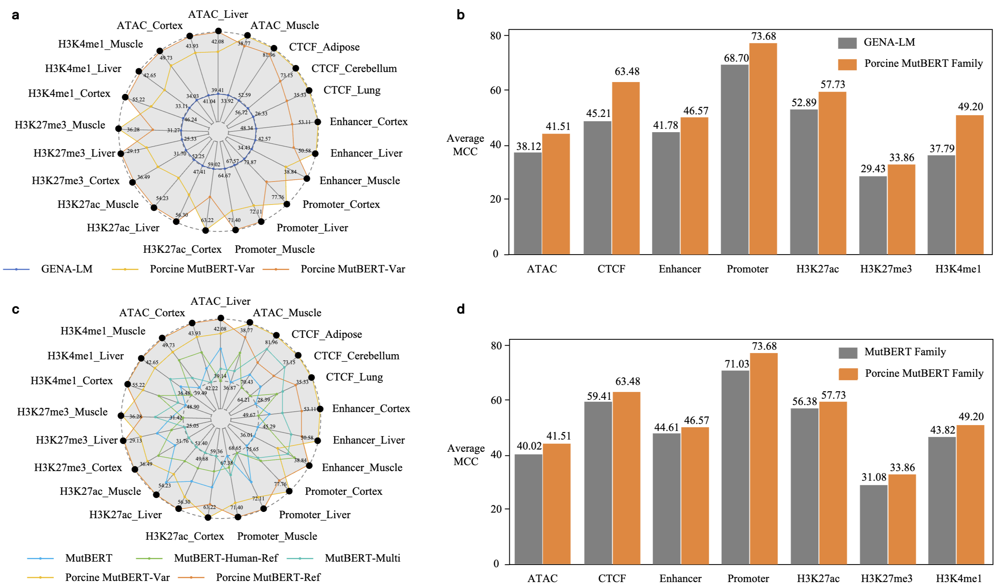

# Porcine MutBERT: A family of Lightweight Genomic Foundation Models for Functional Element Prediction in Pigs

The repo contains the official implementation of "Porcine MutBERT: A family of Lightweight Genomic Foundation Model for Functional Element Prediction in Pigs".

## Contents

- [Porcine MutBERT: A family of Lightweight Genomic Foundation Models for Functional Element Prediction in Pigs](#porcine-mutbert-a-family-of-lightweight-genomic-foundation-models-for-functional-element-prediction-in-pigs)
  - [Contents](#contents)
  - [1. Introduction](#1-introduction)
  - [2. Model and Results](#2-model-and-results)
  - [3. Setup environment](#3-setup-environment)
  - [4. Quick Start](#4-quick-start)
    - [4.1 Load Tokenizer and Model](#41-load-tokenizer-and-model)
    - [4.2 Get the embeddings](#42-get-the-embeddings)
    - [4.3 With RoPE scaling](#43-with-rope-scaling)
  - [5. Pre-Training](#5-pre-training)
    - [5.1 Pre-Train Data](#51-pre-train-data)
    - [5.2 Pre-Train Code](#52-pre-train-code)
  - [6. Finetune](#6-finetune)


## 1. Introduction

The pig (Sus scrofa) is both an economically important livestock species and a valuable biomedical model. Its genome bears regulatory features shaped by domestication and selection that are often poorly captured by genomic language models (gLMs) trained on human or model-organism data. To address these challenges, we developed Porcine MutBERT, a lightweight gLM with 86 million parameters that employs a probabilistic masking strategy targeting evolutionarily informative single nucleotide polymorphisms (SNPs). This design captures population-specific variation while reducing computational cost. We further propose PorcineBench, a benchmark that evaluates gLM performance across porcine functional genomics tasks, including chromatin accessibility (ATAC-seq), CTCF binding, and histone modifications (H3K27ac, H3K4me1, H3K4me3). Results show that Porcine MutBERT can consistently outperforms larger generalist models while offering faster training and greater deployment feasibility. These findings underscore the advantages of species-adapted, efficient architectures in agricultural genomics and demonstrate that compact gLMs can expand accessibility and impact in resource-constrained settings.




## 2. Model and Results

The all 2 pre-trained models are available at Huggingface as `CompBioDSA/pig-mutbert-var`, `CompBioDSA/pig-mutbert-ref`. [Link to HuggingFace ModelHub](https://huggingface.co/CompBioDSA).





## 3. Setup environment

```bash
# create and activate virtual python environment
conda create -n pigmutbert python=3.12
conda activate pigmutbert

# install required packages
pip install -r requirements.txt
```

## 4. Quick Start

Our model is easy to use with the [transformers](https://github.com/huggingface/transformers) package.

### 4.1 Load Tokenizer and Model

To load the model from huggingface:

```python
from transformers import AutoTokenizer, AutoModel

model_name = "CompBioDSA/pig-mutbert-var"
# Optional: CompBioDSA/pig-mutbert-ref
tokenizer = AutoTokenizer.from_pretrained(model_name)
model = AutoModel.from_pretrained(model_name, trust_remote_code=True)
cls_model = AutoModelForSequenceClassification.from_pretrained(model_name, trust_remote_code=True, num_labels=2)
```

### 4.2 Get the embeddings

To get the embeddings of a dna sequence

```python
import torch
import torch.nn.functional as F

from transformers import AutoTokenizer, AutoModel

model_name = "CompBioDSA/pig-mutbert-var"
# Optional: CompBioDSA/pig-mutbert-ref
tokenizer = AutoTokenizer.from_pretrained(model_name)
model = AutoModel.from_pretrained(model_name, trust_remote_code=True)

dna = "ATCGGGGCCCATTA"
inputs = tokenizer(dna, return_tensors='pt')["input_ids"]

mut_inputs = F.one_hot(inputs, num_classes=len(tokenizer)).float().to("cpu")  # len(tokenizer) is vocab size
last_hidden_state = model(mut_inputs).last_hidden_state   # [1, sequence_length, 768]
# or: last_hidden_state = model(mut_inputs)[0]        # [1, sequence_length, 768]

# embedding with mean pooling
embedding_mean = torch.mean(last_hidden_state[0], dim=0)
print(embedding_mean.shape) # expect to be 768

# embedding with max pooling
embedding_max = torch.max(last_hidden_state[0], dim=0)[0]
print(embedding_max.shape) # expect to be 768
```
### 4.3 With RoPE scaling

Allowed types for RoPE scaling are: `linear` and `dynamic`. To extend the model's context window you need to add rope_scaling parameter.

If you want to scale your model context by 2x:

```python
from transformers import AutoModel
model_name = "CompBioDSA/pig-mutbert-var"
# Optional: CompBioDSA/pig-mutbert-ref
model = AutoModel.from_pretrained(model_name,
                                  trust_remote_code=True,
                                  rope_scaling={'type': 'dynamic','factor': 2.0}
                                  ) # 2.0 for x2 scaling, 4.0 for x4, etc..
```


## 5. Pre-Training
### 5.1 Pre-Train Data

The **RAW** training data is available:
- [Sus scrofa Reference Genome](https://ftp.ensembl.org/pub/release-115/fasta/sus_scrofa/dna/): Download `Sus_scrofa.Sscrofa11.1.dna.toplevel.fa.gz`
- [mutation data (40 samples)](https://drive.google.com/file/d/1i1mmqe_OC8cfBTdKuuf3hHy1-hhTWMiN/view?usp=sharing)

After download raw data, we used [seqkit](https://bioinf.shenwei.me/seqkit/) to process `.fa` file . [Link to script](./pretrain_data/process.sh)

We used [bcftools](https://github.com/samtools/bcftools) to process `VCF`files. [Link to script](./pretrain_data/vcf2csv.sh)

You can follow 5 steps to [prepare data](./pretrain_data/prepare_data.py):

1. csv_post_process(): add header of csv files
2. fa2npy(): extract sequence data from hg38.fa.gz, save as chr_name.npy
3. split_by_n(): split sequence data by "N" from chr_name.npy, save as chr_name_part_i.npy
4. create_sm_matrix(): map str to float number, create smooth matrix from chr_name_part_i.npy (str) and clean.chr_name.csv, save as chr_name_part_i.npy (float)
5. cat_all_npy(): concatenate all the interval smooth matrix from chr_name_part_i.npy (float), save as train_data.npy and test_data.npy

### 5.2 Pre-Train Code

We used and modified `run_mlm_no_trainer.py` at [here](https://github.com/huggingface/transformers/blob/main/examples/pytorch/language-modeling/run_mlm_no_trainer.py).

Firstly, open your terminal and run:

```bash
accelerate config
```

Follow the guideline you can config accelerate. 

After that, run [pretrain.sh](./2-pretrain-code/pretrain.sh).

```bash
bash train_ref.sh
# or bash train_mut40.sh
```

## 6. Finetune

We prepared 7 tasks in `finetune/data/{tasks}` at [google drive](https://drive.google.com/file/d/1PEgyLXR6SnNxO4h4fk0tnkNPXBQeXCVN/view?usp=sharing)

You should download the model configs and checkpoints into `finetune/models/{model_name}`

[Run the scripts](./finetune/run_pig.sh) directly, it will automatically load the datasets and perform finetuning.

```
cd finetune
# bash run_pig.sh {model_name} {cuda_id} {use_lora}
bash run_pig.sh pig_mutbert_ref 0 0
# bash run_pig.sh DNABERT2 0 0
# bash run_pig.sh ntv2_500m 0 0
```
